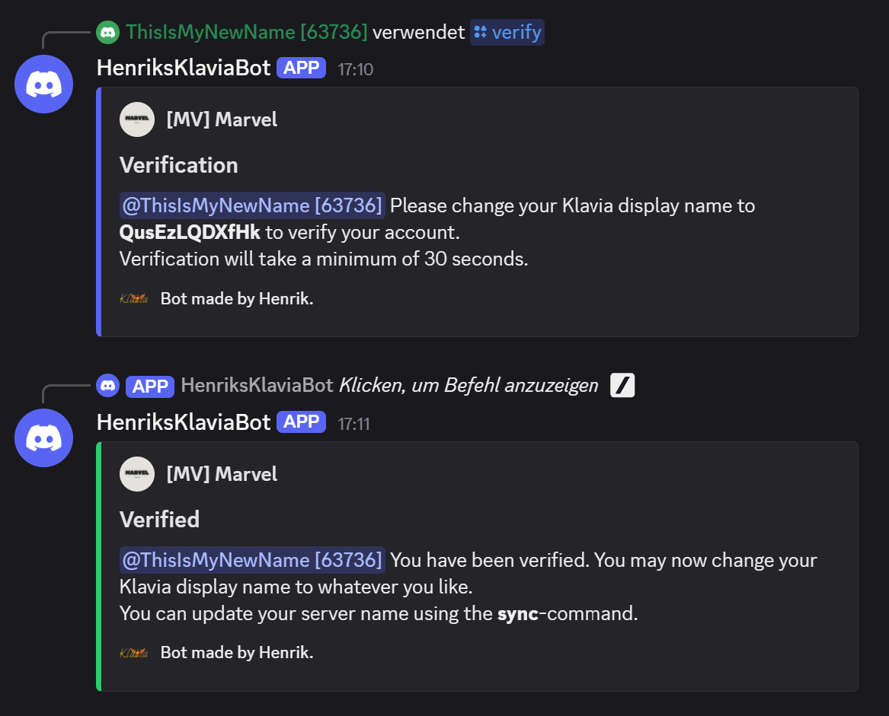
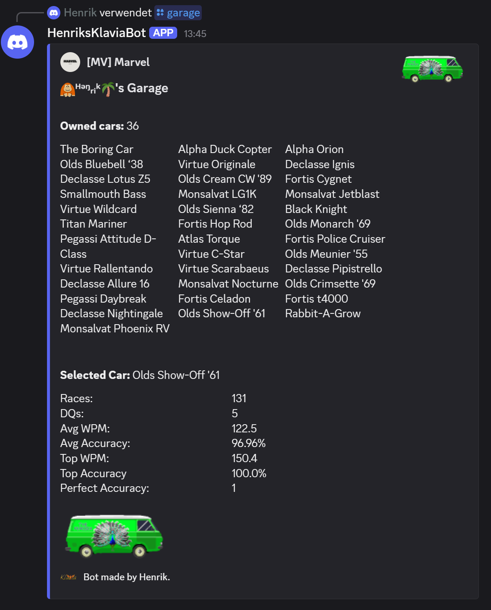
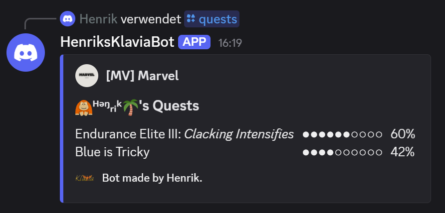

# HenriksKlaviaBot
I got bored, so I decided to write a Discord bot for Klavia.  
Available commands, example images and short documentation can be found below.

## Commands:  
The following commands are currently supported:  
| Command    | Parameters            | Description |
| ---------- | --------------------- | ----------- |
| /setup     | <welcome_channel>     | Runs some setup tasks like creating all necessary roles on the server, etc. Also sets the welcome channel, which will be used for verifying new server members. |
| /verify    | <klavia_id>           | Verifies an account and links it to the given klavia_id. The server display name is updated to mirror the Klavia profile. The profile id is also appended to the display name. |
| /unverify  |                       | Unverifies the user who's using the command. |
| /sync      |                       | Synchronizes the Discord server profile of the user to reflect the linked Klavia account. This includes the displayName for example. |
| /garage    | <optional: klavia_id> | Displays some information about the users garage. |
| /stats     | <optional: klavia_id> | Displays some statistics of the given user. |
| /quests    | <optional: klavia_id> | Displays the users current quests. |

## Currently working on:
### Small scale persistent storage system.  
Initially I wanted to store Klavia IDs in the discord user name, but I've decided to create a simple json file for storing user and server configuration data. This will also allow one instance of the bot to be added to multiple different servers.

## Development Environment
1. Python 3.12  
   This bot has been written in Python 3.12, because unfortunately py-cord does not support 3.13, yet.
2. .env file  
   You must provide a .env file in the project root directory containing your Klavia credentials and Discord bot token.  
   Example .env file:  
    ```
    klavia_username_or_mail=<enter-your-klavia-mail-here>
    klavia_password=<enter-your-klavia-password-here>
    discord_bot_token=<enter-your-bot-token-here>
    ```
3. Discord server setup:  
   Make sure to give the bot sufficient permissions. It needs to do the following things:
   - Create, edit and assign server roles.
   - Edit user profiles.
   - Send messages.
     
   These roles will be automatically created, once you run the setup command:
   - HKBot_unverified
   - HKBot_verification_pending
   - HKBot_verified

## Examples:



